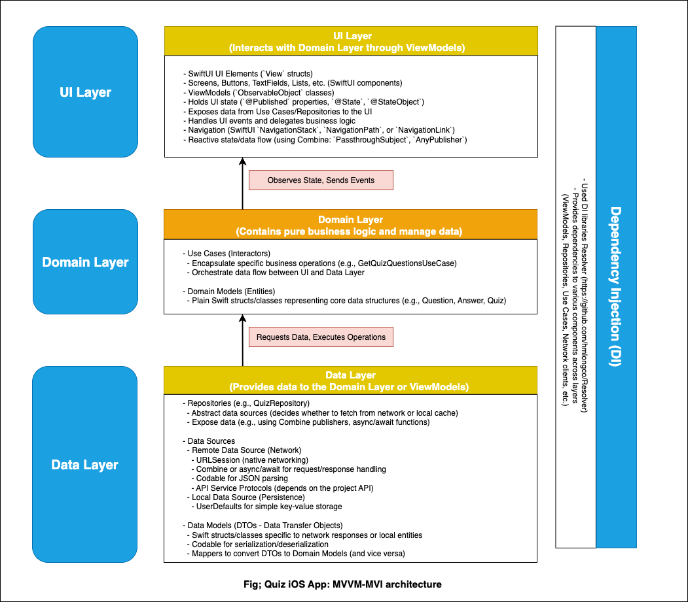

# QuizMaster iOS App

An iOS quiz application built with **SwiftUI** following **Clean Architecture** principles for maintainability, scalability, and testability.  

---

## 🏗 Architecture

### **UI (Presentation) Layer**
- Built using **SwiftUI**.  
- Handles **user interaction** and displays state from the ViewModel.  
- Implements **MVVM/MVI** patterns with `ObservableObject`, `@Published`, and `PassthroughSubject` for reactive state management.  

### **Domain Layer**
- Contains **business logic** and **use cases**.  
- Independent from frameworks and UI.  
- Defines contracts through **protocols** for repository access.  

### **Data Layer**
- Implements repositories defined in the domain layer.  
- Handles data sources (e.g., **local storage, remote APIs**).  
- Uses **decodable models** and **network services** for quiz data.  

### **Dependency Injection**
- Managed using **protocol-oriented design**.  
- Dependencies injected via **initializer injection**.  
- Future-ready for **DI frameworks** like [Resolver](https://github.com/hmlongco/Resolver) or **Swift Dependency Injection** libraries.  

---

## Diagrammatic Representation:

---

## ⚙️ Core Technologies & Libraries
- **SwiftUI** – Declarative UI framework.  
- **Combine** – Reactive programming for data streams.  
- **Clean Architecture (MVVM/MVI)** – Layered design for testability.  
- **Swift Package Manager (SPM)** – Dependency management.  
- (Optional) **Alamofire** – Networking.  
- (Optional) **Resolver** – Dependency injection.  

---

## 🚀 Setup Instructions

1. Clone the repository:
   ```bash
   git clone https://github.com/mrkivan/quiz_app_ios.git
   cd quiz_app_ios
   
2. Open the project in Xcode:
   ```bash
   open QuizMaster.xcodeproj
   
3. Install dependencies (if using SPM/other managers, Xcode will resolve automatically).

4. Run the app on Simulator or real device:
   ```bash
    ⌘ + R

## 📦 Dependencies

- iOS 16.0+
- Xcode 14.0+
- Swift 5.7+    
